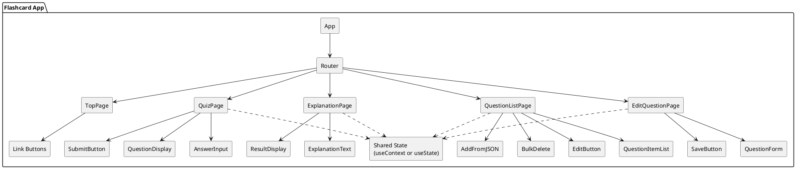

# 📘 単語帳アプリ システム設計書

## 1. 概要

TypeScriptとReactを使って学習目的で作成する「単語帳アプリ」です。基本的なCRUD操作（作成・読取・更新・削除）を通じて、フロントエンドの構築、状態管理、永続化の基礎を学びます。

---

## 2. 技術スタック（初学者向け）

| 分類 | 技術 |
|------|------|
| 言語 | TypeScript |
| フレームワーク | React（React＋Vite） |
| 状態管理 | React `useState` / `useContext` |
| ルーティング | React Router |
| 永続化 | `localStorage`（ブラウザ内の保存領域） |
| ファイル操作 | JSONインポート／エクスポート（FileReader, Blob） |
| UIライブラリ | なし|

---

## 3. 画面構成と遷移

### トップ画面 `/`
- 他画面へのナビゲーションリンク

### 問題表示画面 `/quiz/:id`
- 単語の出題
- 回答欄（テキスト入力）
- 回答ボタン

### 解説画面 `/explanation/:id`
- 回答の正誤表示
- 問題の解説表示

### 問題一覧画面 `/list`
- 問題の一覧表示
- JSONファイルからの問題追加
- 問題の一括削除
- 各問題の編集リンク

### 問題修正画面 `/edit/:id`
- 問題の編集フォーム
- 保存ボタンで更新

---

## 4. データ構造

### TypeScript型定義

```ts
type Question = {
  id: string;            // 一意の識別子（UUID推奨）
  question: string;      // 問題文
  answer: string;        // 正解
  explanation: string;   // 解説文
};
```

## 5. データ保存仕様

- **保存方法**：`localStorage`
    - 問題データは `questions` というキーで保存
    - 永続的にブラウザ内に保存される（容量上限：約5MB）

### 保存・読み込み例

```js
// 保存
localStorage.setItem('questions', JSON.stringify(questions));

// 読み込み
const stored = localStorage.getItem('questions');
const questions = stored ? JSON.parse(stored) : [];
```

---

## 6. JSONファイル連携

### インポート（読み込み）

```jsx
<input type="file" accept=".json" onChange={handleFileUpload} />

const handleFileUpload = (e: React.ChangeEvent<HTMLInputElement>) => {
  const file = e.target.files?.[0];
  if (!file) return;

  const reader = new FileReader();
  reader.onload = () => {
    const result = reader.result as string;
    const newQuestions: Question[] = JSON.parse(result);
    // state と localStorage に保存
  };
  reader.readAsText(file);
};
```

### エクスポート（保存）

```js
const exportToJson = (data: object) => {
  const blob = new Blob([JSON.stringify(data)], { type: 'application/json' });
  const url = URL.createObjectURL(blob);
  const a = document.createElement('a');
  a.href = url;
  a.download = 'questions.json';
  a.click();
  URL.revokeObjectURL(url);
};
```

## 7. コンポーネント構成（PlantUML）



## 8. 今後の拡張案（学習レベルアップ）

- 状態管理の高度化：Zustand, Reduxなどの導入
- データベース連携：Firebase FirestoreやSupabaseの学習
- UIの強化：Tailwind CSSやMaterial UIによるデザイン強化
- テスト導入：JestやReact Testing Libraryの導入
- スマホ対応（PWA）：オフラインで使えるアプリ化